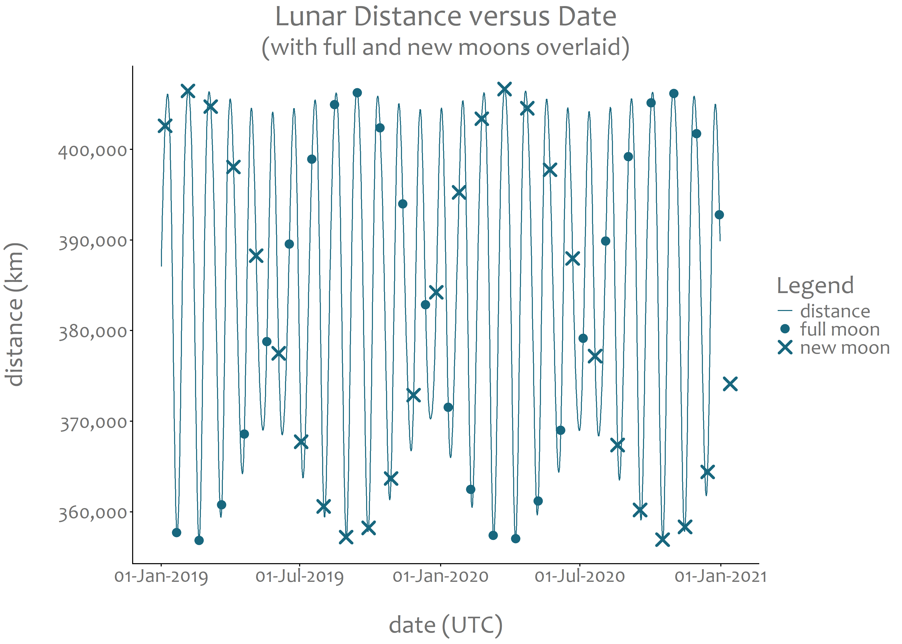

# 21st Century Supermoon Estimation in R

[](../../actions/workflows/super-linter.yml) 

This repository holds digital assets associated with the article "21st Century
Supermoon Estimation in R" [[1](#references)]. That article presents a
supermoon estimator, software that predicts the timing and distance of a
perigee full or new moon for 2001&ndash;2100. Estimates include formal
uncertainties.

---

<figure>
  
  <figcaption>Figure 1. Lunar distance vs. date, over 2019 and 2020. Supermoons occur when a full or new moon coincides with minimum lunar distance. Adapted from [<a href="#references">1</a>].</figcaption>
</figure>

---

## Table of Contents

- [Key Files](#key-files)
- [Software Requirements](#software-requirements)
- [Quality Assurance](#quality-assurance)
- [Getting Started](#getting-started)
- [Acknowledgements](#acknowledgements)
- [References](#references)

## Key Files

| File                   | Notes                                                                                    |
| :--------------------- | :--------------------------------------------------------------------------------------- |
| `src/elp-downloader.R` | R script. Supporting files downloader.                                                   |
| `src/supermoon.Rmd`    | R Markdown. Supermoon estimator.                                                         |
| `out/supermoon.md`     | GitHub-browsable code with example results, including 2001&ndash;2100 supermoon listing. |

## Software Requirements

| Software | Notes                                                                                        |
| :------- | :------------------------------------------------------------------------------------------- |
| R        | [Available here](https://www.r-project.org/). Free.                                          |
| RStudio  | [Available here](https://posit.co/products/open-source/rstudio). Free and fee-based options. |
| Fortran  | [Details here](https://fortran-lang.org/). Free and proprietary compilers available.         |

### R Configuration

Please ensure the R environment has the following packages installed.

- extrafont
- ggplot2
- hms
- knitr
- lubridate
- pkgcond
- Rmpfr
- rmarkdown
- scales
- this.path

Please ensure their dependencies are also installed.

<details>
<summary>Dependencies</summary>

- assertthat
- base64enc
- bslib
- cachem
- cpp11
- digest
- evaluate
- extrafontdb
- farver
- fastmap
- <!-- textlint-disable terminology -->fontawesome<!-- textlint-enable terminology -->
- fs
- generics
- gmp
- gtable
- highr
- htmltools
- isoband
- jquerylib
- jsonlite
- labeling
- memoise
- <!-- textlint-disable terminology -->mime<!-- textlint-enable terminology -->
- pkgconfig
- R6
- rappdirs
- RColorBrewer
- Rttf2pt1
- S7
- <!-- textlint-disable terminology -->sass<!-- textlint-enable terminology -->
- timechange
- tinytex
- viridisLite
- withr
- xfun
- <!-- textlint-disable terminology -->yaml<!-- textlint-enable terminology -->

</details>

## Quality Assurance

The script `elp-downloader.R` and `supermoon.Rmd` have been tested in the
following environment.

<details>
<summary>Windows Test Environment</summary>

<br>

| Type             | Component             | Version                                                                    |
| :--------------- | :-------------------- | :------------------------------------------------------------------------- |
| Platform         | Operating system      | Windows 11, 25H2 (OS Build 26200.9278)                                     |
| Software         | R                     | 4.6.1                                                                      |
| &quot;           | RStudio               | 2026.08.2 (Build 200)                                                      |
| &quot;<br>&nbsp; | GNU Fortran<br>&nbsp; | 16.2.0<br>&nbsp;&nbsp;&nbsp;Run from MSYS2 version 20260611, UCRT64 shell. |

</details>

## Getting Started

### Fortran Lunar Ephemeris

The R Markdown script assumes support by the third-party lunar solution ELP
2000-82B (Éphéméride Lunaire Parisienne 2000-82B) [[2](#references)],
[[3](#references)], [[4](#references)]. Files comprising ELP 2000-82B are
available online [[4](#references)] from Laboratoire Temps Espace (formerly
Institut de Mécanique Céleste et de Calcul des Éphémérides). Please review the
associated [legal notices](https://www.imcce.fr/mentions-legales) for usage
conditions.

#### Fortran Files Download

The ELP 2000-82B files needed to support the supermoon estimator are the
Fortran program `elp82b_2.f` and the associated data files `ELP1` to `ELP36`.
The script `elp-downloader.R`, included in this repository, will download and
lint those files. `elp-downloader.R` may be run from R or RStudio.

- `elp82b_2.f` should be auto-downloaded and linted via `elp-downloader.R`, not
  manually downloaded raw.

#### Fortran Files Compilation

The downloaded program `elp82b_2.f` should be compiled into either a shared
object on Unix/Linux (`elp82b_2.so`), or DLL on Windows (`elp82b_2.dll`).

- `elp82b_2.f` is a legacy FORTRAN 77 program and should be compiled
  accordingly.
- The R Markdown script will fail if the compiled program isn't named
  `elp82b_2.so` or `elp82b_2.dll`.
- The compiled program, data files `ELP1` to `ELP36` and R Markdown script
  must be located in the same directory.

Example command line compilation syntax for GNU Fortran on Windows, via the
MSYS2 UCRT64 shell:

    gfortran src/elp82b_2.f -o src/elp82b_2.dll -ffixed-form -fimplicit-none -fno-automatic -shared

#### GFortran Compiler Flags

| Compiler Flag     | Notes                                                |
| :---------------- | :--------------------------------------------------- |
| `-o`              | Name of the output file.                             |
| `-ffixed-form`    | Compiles using legacy fixed form layout rules.       |
| `-fimplicit-none` | Forces all variables to be declared.                 |
| `-fno-automatic`  | Compiles using legacy-compatible memory management.  |
| `-shared`         | Compiles a dynamic shared library (`.so` or `.dll`). |

### Supermoon Estimation

The file `supermoon.Rmd` should be run from RStudio.

#### Run

The R Markdown file may be run interactively from the **Run** dropdown menu in
the RStudio source pane.

#### Knit

The R Markdown file may be knit interactively from the **Knit** dropdown menu
in the RStudio source pane. Faster, non-interactive knitting, can be
triggered from the RStudio console. Here, any prepended blank line is removed,
for linter compatibility.

```r
rmarkdown::render("supermoon.Rmd")
md_file <- "supermoon.md"
lines <- readLines(md_file, warn = FALSE)
if (length(lines) > 0 && lines[1] == "") {
  writeLines(lines[-1], md_file)
}
rm(md_file, lines)
```

Markdown with pre-knitted results, including a 2001&ndash;2100 supermoon
listing, is [available here](out/supermoon.md).

## Acknowledgements

This repository used Gemini 3.6 and 3.7 Flash
[[5](#references), [6](#references)] as assistive tools to help resolve
Fortran-R integration issues and provide performance tuning tips.

## References

1. T. N. Stenborg, "21st Century Supermoon Estimation in R", in _Astron.
   Data Anal. Softw. Syst. XXX_, in Astronomical Society of the Pacific
   Conference Series, vol. 532, J. E. Ruiz, F Pierfederici and P. Teuben,
   Eds., 2022, pp. 247&ndash;250.\
   [View PDF](https://aspbooks.org/publications/532/247.pdf)
   &nbsp; [View at publisher](https://aspbooks.org/custom/publications/paper/532-0247.html)
   &nbsp; [SciX](https://scixplorer.org/abs/2022ASPC..532..247S/abstract)

2. M. Chapront-Touzé and J. Chapront, "The lunar ephemeris ELP 2000", _A&A_,
   vol. 124, pp. 50&ndash;62, Aug. 1983.\
   [View PDF](https://scixplorer.org/link_gateway/1983A%26A...124...50C/ADS_PDF)
   &nbsp; [SciX](https://scixplorer.org/abs/1983A%26A...124...50C/abstract)

3. M. Chapront-Touzé and J. Chapront, "ELP 2000-85: a semi-analytical lunar
   ephemeris adequate for historical times", _A&A_, vol. 190, pp.
   342&ndash;352, Jan. 1988.\
   [View PDF](https://scixplorer.org/link_gateway/1988A%26A...190..342C/ADS_PDF)
   &nbsp; [SciX](https://scixplorer.org/abs/1988A%26A...190..342C/abstract)

4. M. Chapront-Touzé and J. Chapront. Lunar Solution ELP 2000-82B. (Feb. 1996).
   Laboratoire Temps Espace public FTP server. Institut de Mécanique Céleste et
   de Calcul des Éphémérides, Observatoire de Paris. Accessed: 09 Aug 2026.
   [Online]. Available: <https://ftp.imcce.fr/pub/ephem/moon/elp82b/>

5. _Gemini 3.6 Flash_. (Large language model, July 2026 release). Google.
   [Online]. Available: [google.com](https://www.google.com/).

6. _Gemini 3.7 Flash_. (Large language model, August 2026 release). Google.
   [Online]. Available: [google.com](https://www.google.com/).
