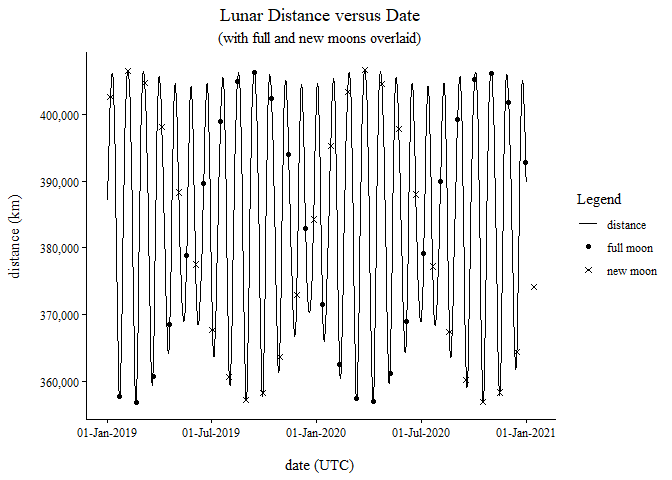

# 21st Century Supermoon Estimation in R

    Precision Testing
    -----------------

    Julian Ephemeris Day (JDE), target value.
      2443259.9

    JDE, stored as a numeric variable (low precision).
      2443259.8999999999

    JDE, stored as a MPFR variable (high precision).
      2443259.9000000000

    Converting JDE to dynamical time.
       low precision: 1977-04-26 09:35:59.999991 UTC
      high precision: 1977-04-26 09:36:00 UTC

    Corresponding difference in lunar distance.
      ≈0.5 mm

    Testing
    -------

    Test the system's functions against examples in 'Astronomical Algorithms'.
    Ref: J. Meeus, Astronomical Algorithms, 2nd ed., Richmond, VA, USA:
         Willmann-Bell, 1998.

    a) Testing: New Moon Feb 1977 (page 353).

    Next new moon:             2443192.6512 +- 0.0002 JDE
                             = 18-Feb-1977 03:37:42 +- 00:00:16 Dynamical Time
                             = 18-Feb-1977 03:36:54 +- 00:00:16 UTC

    Expected:                  18-Feb-1977 03:37 UT.
                               N.B. UT = UTC +- 0.9 s.

    b) Testing: Last Quarter Moon Jan 2044 (page 353).

    Next last quarter:         2467636.4919 +- 0.0002 JDE
                             = 21-Jan-2044 23:48:17 +- 00:00:13 Dynamical Time
    Expected:                  21-Jan-2044 23:48:17 Dynamical Time.

    c) Testing: Lunar Apogee Oct 1988 (page 357).

    Next new moon:             2447442.354 +- 0.002 JDE
                             = 07-Oct-1988 20:29:41 +- 00:03:00 Dynamical Time
    Expected:                  07-Oct-1988 20:29 Dynamical Time.

    d) Testing: Lunar Distance for 12 April 1992, at 00:00:00 Dynamical Time
                (pages 342-343).

    Estimated lunar distance:  368410 +- 4 km
    Expected:                  368409.7 km.

    Lunar distance benchmarking: astropixels.com
    --------------------------------------------

    Target date:            09-Jan-2001 20:24:00 UTC

    Lunar distance
    Estimate, astropixels:  357406 +- <unspecified> km
    Estimate, R:            357408 +- 1 km

    ------
    Target date:            04-Jul-2050 18:51:00 UTC

    Lunar distance
    Estimate, astropixels:  367058 +- <unspecified> km
    Estimate, R:            367057 +- 4 km

    ------
    Target date:            23-May-2100 17:25:00 UTC

    Lunar distance
    Estimate, astropixels:  360904 +- <unspecified> km
    Estimate, R:            360904 +- 1 km

    Lunar distance benchmarking: www.fourmilab.ch
    ---------------------------------------------

    Target date:            10-Jan-2001 09:00:00 +- 00:00:02 UTC

    Lunar distance
    Estimate, fourmilab:    357131.0 +- 0.8 km*
    Estimate, R:            357131.0 +- 0.8 km

    ------
    Target date:            07-Jul-2050 02:26:00 +- 00:00:02 UTC

    Lunar distance
    Estimate, fourmilab:    363255 +- 2 km*
    Estimate, R:            363255 +- 2 km

    ------
    Target date:            22-May-2100 11:08:00 +- 00:00:02 UTC

    Lunar distance
    Estimate, fourmilab:    359497 +- 3 km*
    Estimate, R:            359493 +- 3 km

    * Assumed uncertainty, from ELP 2000-82.

    Example 1
    ---------

    For a target date, determine the time of the next,
      a) full moon,
      b) perigee and associated lunar distance.

                Target date:   18-Feb-2029 00:00:00 UTC
                             = 18-Feb-2029 00:01:17 +- 6s Dynamical Time

             Next full moon:   2462196.2163 +- 2e-04 JDE
                             = 28-Feb-2029 17:11:27 +- 00:00:17 Dynamical Time
                             = 28-Feb-2029 17:10:10 +- 00:00:56 UTC

               Next perigee:   2462197.27 +- 0.02 JDE
                             = 01-Mar-2029 18:30:52 +- 00:31:00 Dynamical Time
                             = 01-Mar-2029 18:29:35 +- 00:31:00 UTC

    Lunar distance at perigee: 358630 +- 3 km

    Example 2
    ---------

    Graph variation in lunar distance for 2019-2020.
    Overlay full and new moons.

    Saving 4.9 x 3.5 in image

    Example 3
    ---------

    Get all 21st century supermoons.
    Define 'supermoon' as a full moon and lunar perigee separated by <= 12 h.

    ---------------------------------------------
    supermoon #1
     full moon:                08-Feb-2001 07:11:33 +- 00:00:17 UTC
     perigee:                  07-Feb-2001 22:18:46 +- 00:31:00 UTC
     distance at perigee:      356854 +- 2 km

    supermoon #2
     full moon:                27-Feb-2002 09:16:38 +- 00:00:17 UTC
     perigee:                  27-Feb-2002 19:47:12 +- 00:31:00 UTC
     distance at perigee:      356903 +- 5 km

    supermoon #3
     full moon:                28-Mar-2002 18:24:50 +- 00:00:17 UTC
     perigee:                  28-Mar-2002 07:41:41 +- 00:31:00 UTC
     distance at perigee:      357014 +- 4 km

    supermoon #4
     full moon:                16-Apr-2003 19:35:34 +- 00:00:17 UTC
     perigee:                  17-Apr-2003 04:57:37 +- 00:31:00 UTC
     distance at perigee:      357156.6 +- 0.5 km

    supermoon #5
     full moon:                16-May-2003 03:35:56 +- 00:00:17 UTC
     perigee:                  15-May-2003 15:39:16 +- 00:31:00 UTC
     distance at perigee:      357451 +- 1 km

    supermoon #6
     full moon:                03-Jun-2004 04:19:33 +- 00:00:17 UTC
     perigee:                  03-Jun-2004 13:09:47 +- 00:31:00 UTC
     distance at perigee:      357250 +- 3 km

    supermoon #7
     full moon:                02-Jul-2004 11:08:51 +- 00:00:17 UTC
     perigee:                  01-Jul-2004 22:59:39 +- 00:31:00 UTC
     distance at perigee:      357448.8 +- 0.8 km

    supermoon #8
     full moon:                21-Jul-2005 11:00:08 +- 00:00:17 UTC
     perigee:                  21-Jul-2005 19:44:29 +- 00:31:00 UTC
     distance at perigee:      357161 +- 2 km

    supermoon #9
     full moon:                19-Aug-2005 17:52:54 +- 00:00:17 UTC
     perigee:                  19-Aug-2005 05:32:04 +- 00:31:00 UTC
     distance at perigee:      357399 +- 6 km

    supermoon #10
     full moon:                07-Sep-2006 18:41:56 +- 00:00:17 UTC
     perigee:                  08-Sep-2006 03:07:14 +- 00:31:00 UTC
     distance at perigee:      357178 +- 2 km

    supermoon #11
     full moon:                26-Oct-2007 04:51:34 +- 00:00:17 UTC
     perigee:                  26-Oct-2007 11:51:14 +- 00:31:00 UTC
     distance at perigee:      356755 +- 3 km

    supermoon #12
     full moon:                12-Dec-2008 16:37:12 +- 00:00:17 UTC
     perigee:                  12-Dec-2008 21:36:59 +- 00:31:00 UTC
     distance at perigee:      356569 +- 4 km

    supermoon #13
     full moon:                30-Jan-2010 06:17:31 +- 00:00:17 UTC
     perigee:                  30-Jan-2010 09:02:39 +- 00:31:00 UTC
     distance at perigee:      356594 +- 1 km

    supermoon #14
     full moon:                19-Mar-2011 18:10:02 +- 00:00:17 UTC
     perigee:                  19-Mar-2011 19:09:04 +- 00:31:00 UTC
     distance at perigee:      356579 +- 4 km

    supermoon #15
     full moon:                06-May-2012 03:35:07 +- 00:00:17 UTC
     perigee:                  06-May-2012 03:32:45 +- 00:31:00 UTC
     distance at perigee:      356954 +- 1 km

    supermoon #16
     full moon:                23-Jun-2013 11:32:13 +- 00:00:17 UTC
     perigee:                  23-Jun-2013 11:09:24 +- 00:31:00 UTC
     distance at perigee:      356991.5 +- 0.3 km

    supermoon #17
     full moon:                10-Aug-2014 18:09:17 +- 00:00:17 UTC
     perigee:                  10-Aug-2014 17:43:01 +- 00:31:00 UTC
     distance at perigee:      356898 +- 3 km

    supermoon #18
     full moon:                28-Sep-2015 02:50:29 +- 00:00:17 UTC
     perigee:                  28-Sep-2015 01:45:55 +- 00:31:00 UTC
     distance at perigee:      356876.7 +- 0.6 km

    supermoon #19
     full moon:                14-Nov-2016 13:52:08 +- 00:00:17 UTC
     perigee:                  14-Nov-2016 11:22:36 +- 00:31:00 UTC
     distance at perigee:      356512 +- 3 km

    supermoon #20
     full moon:                02-Jan-2018 02:24:04 +- 00:00:17 UTC
     perigee:                  01-Jan-2018 21:54:30 +- 00:31:00 UTC
     distance at perigee:      356568 +- 3 km

    supermoon #21
     full moon:                19-Feb-2019 15:53:29 +- 00:00:17 UTC
     perigee:                  19-Feb-2019 09:05:45 +- 00:31:00 UTC
     distance at perigee:      356763 +- 2 km

    supermoon #22
     full moon:                08-Apr-2020 02:34:57 +- 00:00:17 UTC
     perigee:                  07-Apr-2020 18:08:21 +- 00:31:00 UTC
     distance at perigee:      356911 +- 4 km

    supermoon #23
     full moon:                27-Apr-2021 03:31:30 +- 00:00:17 UTC
     perigee:                  27-Apr-2021 15:24:14 +- 00:31:00 UTC
     distance at perigee:      357377.5 +- 1 km

    supermoon #24
     full moon:                26-May-2021 11:13:56 +- 00:00:17 UTC
     perigee:                  26-May-2021 01:51:56 +- 00:31:00 UTC
     distance at perigee:      357312 +- 1 km

    supermoon #25
     full moon:                14-Jun-2022 11:51:39 +- 00:00:17 UTC
     perigee:                  14-Jun-2022 23:21:25 +- 00:31:00 UTC
     distance at perigee:      357435 +- 2 km

    supermoon #26
     full moon:                13-Jul-2022 18:37:31 +- 00:00:17 UTC
     perigee:                  13-Jul-2022 09:08:03 +- 00:31:00 UTC
     distance at perigee:      357263.4 +- 0.8 km

    supermoon #27
     full moon:                01-Aug-2023 18:31:32 +- 00:00:17 UTC
     perigee:                  02-Aug-2023 05:51:50 +- 00:31:00 UTC
     distance at perigee:      357312 +- 1 km

    supermoon #28
     full moon:                31-Aug-2023 01:35:32 +- 00:00:17 UTC
     perigee:                  30-Aug-2023 15:51:07 +- 00:31:00 UTC
     distance at perigee:      357185 +- 4 km

    supermoon #29
     full moon:                18-Sep-2024 02:34:24 +- 00:00:17 UTC
     perigee:                  18-Sep-2024 13:26:30 +- 00:31:00 UTC
     distance at perigee:      357286 +- 0.5 km

    supermoon #30
     full moon:                17-Oct-2024 11:26:29 +- 00:00:17 UTC
     perigee:                  17-Oct-2024 00:45:36 +- 00:31:00 UTC
     distance at perigee:      357173 +- 2 km

    supermoon #31
     full moon:                05-Nov-2025 13:19:20 +- 00:00:17 UTC
     perigee:                  05-Nov-2025 22:28:58 +- 00:31:00 UTC
     distance at perigee:      356833.2 +- 0.4 km

    supermoon #32
     full moon:                04-Dec-2025 23:14:07 +- 00:00:17 UTC
     perigee:                  04-Dec-2025 11:06:01 +- 00:31:00 UTC
     distance at perigee:      356965 +- 3 km

    supermoon #33
     full moon:                24-Dec-2026 01:28:17 +- 00:00:47 UTC
     perigee:                  24-Dec-2026 08:29:32 +- 00:31:38 UTC
     distance at perigee:      356652 +- 1 km

    supermoon #34
     full moon:                10-Feb-2028 15:03:35 +- 00:00:56 UTC
     perigee:                  10-Feb-2028 19:53:16 +- 00:31:00 UTC
     distance at perigee:      356679.7 +- 0.6 km

    supermoon #35
     full moon:                30-Mar-2029 02:26:28 +- 00:00:47 UTC
     perigee:                  30-Mar-2029 05:39:48 +- 00:31:39 UTC
     distance at perigee:      356666 +- 2 km

    supermoon #36
     full moon:                17-May-2030 11:19:03 +- 00:00:56 UTC
     perigee:                  17-May-2030 13:45:20 +- 00:31:39 UTC
     distance at perigee:      357017 +- 2 km

    supermoon #37
     full moon:                04-Jul-2031 19:01:11 +- 00:00:57 UTC
     perigee:                  04-Jul-2031 21:13:33 +- 00:31:39 UTC
     distance at perigee:      357009.2 +- 0.9 km

    supermoon #38
     full moon:                21-Aug-2032 01:46:37 +- 00:00:57 UTC
     perigee:                  21-Aug-2032 03:51:38 +- 00:31:40 UTC
     distance at perigee:      356881 +- 2 km

    supermoon #39
     full moon:                08-Oct-2033 10:58:01 +- 00:00:57 UTC
     perigee:                  08-Oct-2033 12:11:20 +- 00:31:40 UTC
     distance at perigee:      356824 +- 2 km

    supermoon #40
     full moon:                25-Nov-2034 22:32:00 +- 00:00:58 UTC
     perigee:                  25-Nov-2034 22:06:15 +- 00:31:40 UTC
     distance at perigee:      356448 +- 3 km

    supermoon #41
     full moon:                13-Jan-2036 11:15:59 +- 00:00:58 UTC
     perigee:                  13-Jan-2036 08:47:17 +- 00:31:41 UTC
     distance at perigee:      356519 +- 2 km

    supermoon #42
     full moon:                02-Mar-2037 00:27:56 +- 00:00:59 UTC
     perigee:                  01-Mar-2037 19:47:57 +- 00:31:00 UTC
     distance at perigee:      356711 +- 3 km

    supermoon #43
     full moon:                19-Apr-2038 10:35:40 +- 00:00:50 UTC
     perigee:                  19-Apr-2038 04:30:20 +- 00:31:42 UTC
     distance at perigee:      356843 +- 6 km

    supermoon #44
     full moon:                06-Jun-2039 18:47:35 +- 00:01:00 UTC
     perigee:                  06-Jun-2039 12:01:15 +- 00:31:00 UTC
     distance at perigee:      357207 +- 2 km

    supermoon #45
     full moon:                24-Jul-2040 02:05:23 +- 00:01:00 UTC
     perigee:                  23-Jul-2040 19:14:58 +- 00:31:21 UTC
     distance at perigee:      357112 +- 2 km

    supermoon #46
     full moon:                10-Sep-2041 09:23:36 +- 00:00:17 UTC
     perigee:                  10-Sep-2041 02:12:15 +- 00:31:22 UTC
     distance at perigee:      357006 +- 6 km

    supermoon #47
     full moon:                28-Oct-2042 19:48:32 +- 00:00:43 UTC
     perigee:                  28-Oct-2042 11:27:14 +- 00:31:43 UTC
     distance at perigee:      356973 +- 2 km

    supermoon #48
     full moon:                16-Nov-2043 21:52:28 +- 00:00:53 UTC
     perigee:                  17-Nov-2043 09:11:04 +- 00:31:44 UTC
     distance at perigee:      356948 +- 1 km

    supermoon #49
     full moon:                16-Dec-2043 08:01:48 +- 00:01:01 UTC
     perigee:                  15-Dec-2043 22:00:39 +- 00:31:44 UTC
     distance at perigee:      356772 +- 4 km

    supermoon #50
     full moon:                03-Jan-2045 10:20:13 +- 00:01:02 UTC
     perigee:                  03-Jan-2045 19:24:57 +- 00:31:22 UTC
     distance at perigee:      356774 +- 1 km

    supermoon #51
     full moon:                01-Feb-2045 21:05:30 +- 00:00:44 UTC
     perigee:                  01-Feb-2045 08:42:54 +- 00:31:44 UTC
     distance at perigee:      357105 +- 1 km

    supermoon #52
     full moon:                20-Feb-2046 23:43:59 +- 00:01:02 UTC
     perigee:                  21-Feb-2046 06:42:54 +- 00:31:22 UTC
     distance at perigee:      356806 +- 2 km

    supermoon #53
     full moon:                10-Apr-2047 10:35:12 +- 00:00:54 UTC
     perigee:                  10-Apr-2047 16:08:00 +- 00:31:00 UTC
     distance at perigee:      356790 +- 4 km

    supermoon #54
     full moon:                27-May-2048 18:57:03 +- 00:01:03 UTC
     perigee:                  27-May-2048 23:56:00 +- 00:31:46 UTC
     distance at perigee:      357115 +- 1 km

    supermoon #55
     full moon:                15-Jul-2049 02:29:15 +- 00:01:04 UTC
     perigee:                  15-Jul-2049 07:18:19 +- 00:31:23 UTC
     distance at perigee:      357062 +- 1 km

    supermoon #56
     full moon:                01-Sep-2050 09:30:34 +- 00:00:56 UTC
     perigee:                  01-Sep-2050 14:02:31 +- 00:31:24 UTC
     distance at perigee:      356899 +- 4 km

    supermoon #57
     full moon:                19-Oct-2051 19:12:50 +- 00:01:06 UTC
     perigee:                  19-Oct-2051 22:40:51 +- 00:31:48 UTC
     distance at perigee:      356809 +- 2 km

    supermoon #58
     full moon:                06-Dec-2052 07:17:40 +- 00:01:07 UTC
     perigee:                  06-Dec-2052 08:52:07 +- 00:31:49 UTC
     distance at perigee:      356425 +- 4 km

    supermoon #59
     full moon:                23-Jan-2054 20:07:38 +- 00:01:08 UTC
     perigee:                  23-Jan-2054 19:37:41 +- 00:31:51 UTC
     distance at perigee:      356512 +- 1 km

    supermoon #60
     full moon:                13-Mar-2055 08:56:47 +- 00:01:09 UTC
     perigee:                  13-Mar-2055 06:24:41 +- 00:31:26 UTC
     distance at perigee:      356698 +- 4 km

    supermoon #61
     full moon:                29-Apr-2056 18:30:49 +- 00:01:10 UTC
     perigee:                  29-Apr-2056 14:48:16 +- 00:31:27 UTC
     distance at perigee:      356811 +- 5 km

    supermoon #62
     full moon:                17-Jun-2057 02:18:10 +- 00:01:03 UTC
     perigee:                  16-Jun-2057 22:07:57 +- 00:31:54 UTC
     distance at perigee:      357136 +- 2 km

    supermoon #63
     full moon:                04-Aug-2058 09:37:28 +- 00:01:13 UTC
     perigee:                  04-Aug-2058 05:22:10 +- 00:31:55 UTC
     distance at perigee:      356996 +- 2 km

    supermoon #64
     full moon:                21-Sep-2059 17:18:17 +- 00:01:14 UTC
     perigee:                  21-Sep-2059 12:34:20 +- 00:31:57 UTC
     distance at perigee:      356863 +- 5 km

    supermoon #65
     full moon:                08-Nov-2060 04:17:14 +- 00:01:15 UTC
     perigee:                  07-Nov-2060 22:11:18 +- 00:31:58 UTC
     distance at perigee:      356812 +- 3 km

    supermoon #66
     full moon:                26-Dec-2061 16:52:34 +- 00:01:16 UTC
     perigee:                  26-Dec-2061 08:55:32 +- 00:31:59 UTC
     distance at perigee:      356619 +- 3 km

    supermoon #67
     full moon:                14-Jan-2063 19:11:30 +- 00:01:17 UTC
     perigee:                  15-Jan-2063 06:21:14 +- 00:31:30 UTC
     distance at perigee:      356937 +- 2 km

    supermoon #68
     full moon:                13-Feb-2063 05:48:26 +- 00:01:18 UTC
     perigee:                  12-Feb-2063 19:32:29 +- 00:32:00 UTC
     distance at perigee:      356964 +- 3 km

    supermoon #69
     full moon:                03-Mar-2064 08:18:35 +- 00:01:19 UTC
     perigee:                  03-Mar-2064 17:31:58 +- 00:31:31 UTC
     distance at perigee:      356971.3 +- 0.4 km

    supermoon #70
     full moon:                01-Apr-2064 17:40:07 +- 00:01:10 UTC
     perigee:                  01-Apr-2064 05:28:34 +- 00:32:01 UTC
     distance at perigee:      357235.9 +- 0.7 km

    supermoon #71
     full moon:                20-Apr-2065 18:35:47 +- 00:01:20 UTC
     perigee:                  21-Apr-2065 02:33:38 +- 00:32:02 UTC
     distance at perigee:      356952 +- 2 km

    supermoon #72
     full moon:                08-Jun-2066 02:30:39 +- 00:01:21 UTC
     perigee:                  08-Jun-2066 10:05:32 +- 00:32:04 UTC
     distance at perigee:      357248 +- 2 km

    supermoon #73
     full moon:                26-Jul-2067 09:58:15 +- 00:01:22 UTC
     perigee:                  26-Jul-2067 17:23:09 +- 00:32:05 UTC
     distance at perigee:      357148.8 +- 0.4 km

    supermoon #74
     full moon:                11-Sep-2068 17:18:56 +- 00:01:23 UTC
     perigee:                  12-Sep-2068 00:16:36 +- 00:31:33 UTC
     distance at perigee:      356953 +- 4 km

    supermoon #75
     full moon:                30-Oct-2069 03:35:07 +- 00:01:25 UTC
     perigee:                  30-Oct-2069 09:15:28 +- 00:31:34 UTC
     distance at perigee:      356831 +- 1 km

    supermoon #76
     full moon:                17-Dec-2070 16:05:22 +- 00:01:26 UTC
     perigee:                  17-Dec-2070 19:40:29 +- 00:32:09 UTC
     distance at perigee:      356443 +- 4 km

    supermoon #77
     full moon:                04-Feb-2072 04:55:16 +- 00:01:27 UTC
     perigee:                  04-Feb-2072 06:25:22 +- 00:31:35 UTC
     distance at perigee:      356545.9 +- 0.6 km

    supermoon #78
     full moon:                23-Mar-2073 17:16:51 +- 00:01:28 UTC
     perigee:                  23-Mar-2073 16:56:50 +- 00:31:35 UTC
     distance at perigee:      356722 +- 3 km

    supermoon #79
     full moon:                11-May-2074 02:17:28 +- 00:01:30 UTC
     perigee:                  11-May-2074 01:01:44 +- 00:31:36 UTC
     distance at perigee:      356815 +- 4 km

    supermoon #80
     full moon:                28-Jun-2075 09:46:14 +- 00:01:31 UTC
     perigee:                  28-Jun-2075 08:12:49 +- 00:32:13 UTC
     distance at perigee:      357100 +- 1 km

    supermoon #81
     full moon:                14-Aug-2076 17:11:27 +- 00:01:32 UTC
     perigee:                  14-Aug-2076 15:30:05 +- 00:31:37 UTC
     distance at perigee:      356914 +- 3 km

    supermoon #82
     full moon:                02-Oct-2077 01:20:21 +- 00:01:33 UTC
     perigee:                  01-Oct-2077 22:58:31 +- 00:32:16 UTC
     distance at perigee:      356757 +- 7 km

    supermoon #83
     full moon:                19-Nov-2078 12:52:08 +- 00:01:26 UTC
     perigee:                  19-Nov-2078 08:56:51 +- 00:32:17 UTC
     distance at perigee:      356690 +- 1 km

    supermoon #84
     full moon:                07-Jan-2080 01:44:33 +- 00:01:36 UTC
     perigee:                  06-Jan-2080 19:49:31 +- 00:32:18 UTC
     distance at perigee:      356508 +- 4 km

    supermoon #85
     full moon:                23-Feb-2081 14:26:48 +- 00:01:28 UTC
     perigee:                  23-Feb-2081 06:18:34 +- 00:31:40 UTC
     distance at perigee:      356861 +- 2 km

    supermoon #86
     full moon:                14-Mar-2082 16:45:03 +- 00:01:30 UTC
     perigee:                  15-Mar-2082 04:16:53 +- 00:32:21 UTC
     distance at perigee:      357176 +- 1 km

    supermoon #87
     full moon:                13-Apr-2082 01:45:08 +- 00:01:38 UTC
     perigee:                  12-Apr-2082 15:53:20 +- 00:32:21 UTC
     distance at perigee:      357106 +- 2 km

    supermoon #88
     full moon:                02-May-2083 02:29:20 +- 00:01:31 UTC
     perigee:                  02-May-2083 12:56:04 +- 00:31:41 UTC
     distance at perigee:      357150 +- 3 km

    supermoon #89
     full moon:                31-May-2083 09:41:53 +- 00:01:40 UTC
     perigee:                  30-May-2083 23:06:39 +- 00:31:41 UTC
     distance at perigee:      357247 +- 1 km

    supermoon #90
     full moon:                18-Jun-2084 10:00:15 +- 00:01:32 UTC
     perigee:                  18-Jun-2084 20:15:01 +- 00:32:23 UTC
     distance at perigee:      357415 +- 2 km

    supermoon #91
     full moon:                17-Jul-2084 17:01:15 +- 00:01:40 UTC
     perigee:                  17-Jul-2084 06:12:54 +- 00:31:42 UTC
     distance at perigee:      357471.7 +- 0.7 km

    supermoon #92
     full moon:                05-Aug-2085 17:28:51 +- 00:01:33 UTC
     perigee:                  06-Aug-2085 03:30:21 +- 00:32:25 UTC
     distance at perigee:      357270 +- 2 km

    supermoon #93
     full moon:                04-Sep-2085 00:40:57 +- 00:01:40 UTC
     perigee:                  03-Sep-2085 13:42:42 +- 00:32:25 UTC
     distance at perigee:      357232 +- 2 km

    supermoon #94
     full moon:                23-Sep-2086 01:14:37 +- 00:01:40 UTC
     perigee:                  23-Sep-2086 10:35:14 +- 00:32:26 UTC
     distance at perigee:      357041 +- 5 km

    supermoon #95
     full moon:                22-Oct-2086 09:55:31 +- 00:01:35 UTC
     perigee:                  21-Oct-2086 21:59:24 +- 00:31:43 UTC
     distance at perigee:      357178 +- 5 km

    supermoon #96
     full moon:                10-Nov-2087 12:04:45 +- 00:01:40 UTC
     perigee:                  10-Nov-2087 19:53:59 +- 00:32:27 UTC
     distance at perigee:      356889.7 +- 0.5 km

    supermoon #97
     full moon:                28-Dec-2088 00:57:03 +- 00:01:50 UTC
     perigee:                  28-Dec-2088 06:31:50 +- 00:32:29 UTC
     distance at perigee:      356502 +- 6 km

    supermoon #98
     full moon:                14-Feb-2090 13:39:02 +- 00:01:50 UTC
     perigee:                  14-Feb-2090 17:12:55 +- 00:32:30 UTC
     distance at perigee:      356620.4 +- 0.6 km

    supermoon #99
     full moon:                04-Apr-2091 01:31:02 +- 00:01:50 UTC
     perigee:                  04-Apr-2091 03:25:59 +- 00:32:31 UTC
     distance at perigee:      356784 +- 4 km

    supermoon #100
     full moon:                21-May-2092 09:59:48 +- 00:01:50 UTC
     perigee:                  21-May-2092 11:10:29 +- 00:31:46 UTC
     distance at perigee:      356854 +- 3 km

    supermoon #101
     full moon:                08-Jul-2093 17:13:31 +- 00:01:50 UTC
     perigee:                  08-Jul-2093 18:16:58 +- 00:32:34 UTC
     distance at perigee:      357098 +- 0.5 km

    supermoon #102
     full moon:                26-Aug-2094 00:51:25 +- 00:01:50 UTC
     perigee:                  26-Aug-2094 01:39:18 +- 00:31:48 UTC
     distance at perigee:      356867 +- 2 km

    supermoon #103
     full moon:                13-Oct-2095 09:30:14 +- 00:01:50 UTC
     perigee:                  13-Oct-2095 09:25:10 +- 00:32:36 UTC
     distance at perigee:      356687 +- 5 km

    supermoon #104
     full moon:                29-Nov-2096 21:33:48 +- 00:02:00 UTC
     perigee:                  29-Nov-2096 19:43:27 +- 00:32:38 UTC
     distance at perigee:      356609 +- 2 km

    supermoon #105
     full moon:                17-Jan-2098 10:35:40 +- 00:02:00 UTC
     perigee:                  17-Jan-2098 06:41:26 +- 00:32:39 UTC
     distance at perigee:      356437 +- 3 km

    supermoon #106
     full moon:                06-Mar-2099 22:59:22 +- 00:02:00 UTC
     perigee:                  06-Mar-2099 16:59:32 +- 00:31:50 UTC
     distance at perigee:      356797 +- 3 km

    supermoon #107
     full moon:                24-Apr-2100 09:43:26 +- 00:02:00 UTC
     perigee:                  24-Apr-2100 02:13:30 +- 00:31:00 UTC
     distance at perigee:      357012 +- 1 km

    ---------------------------------------------
